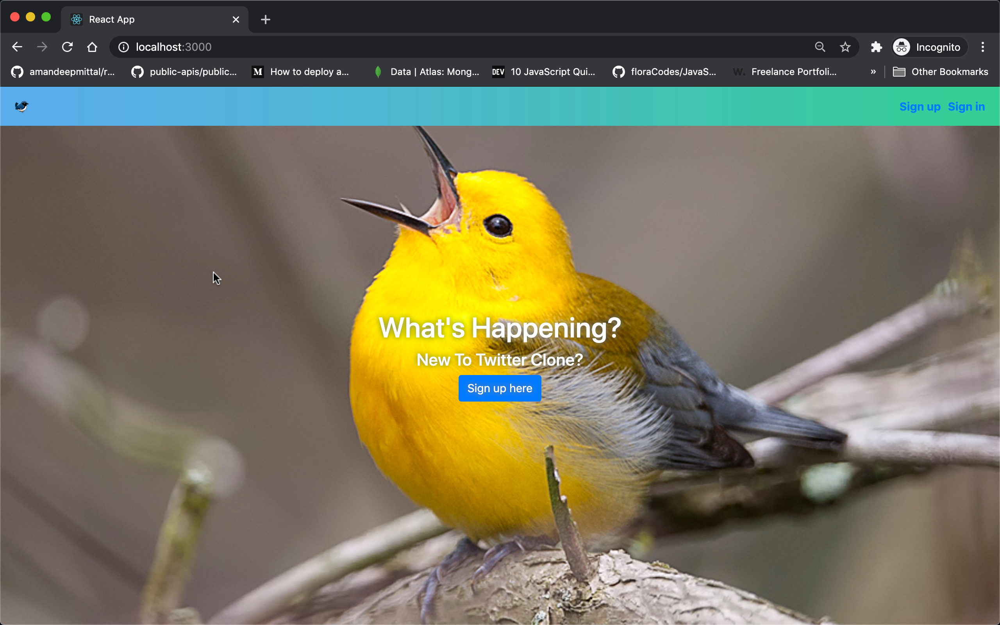
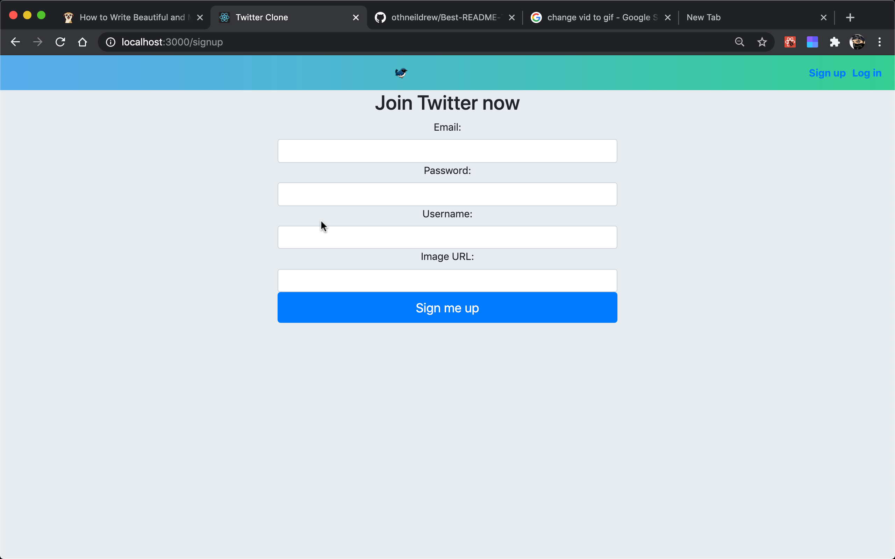
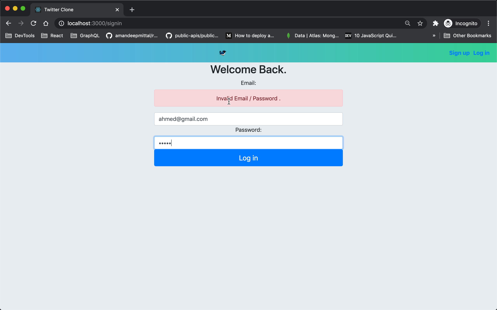
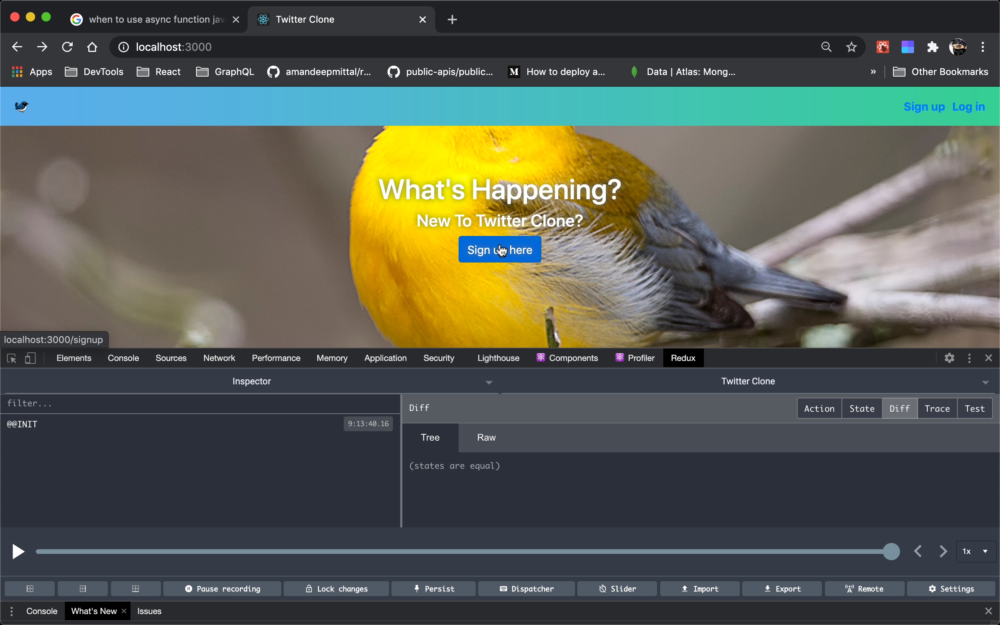
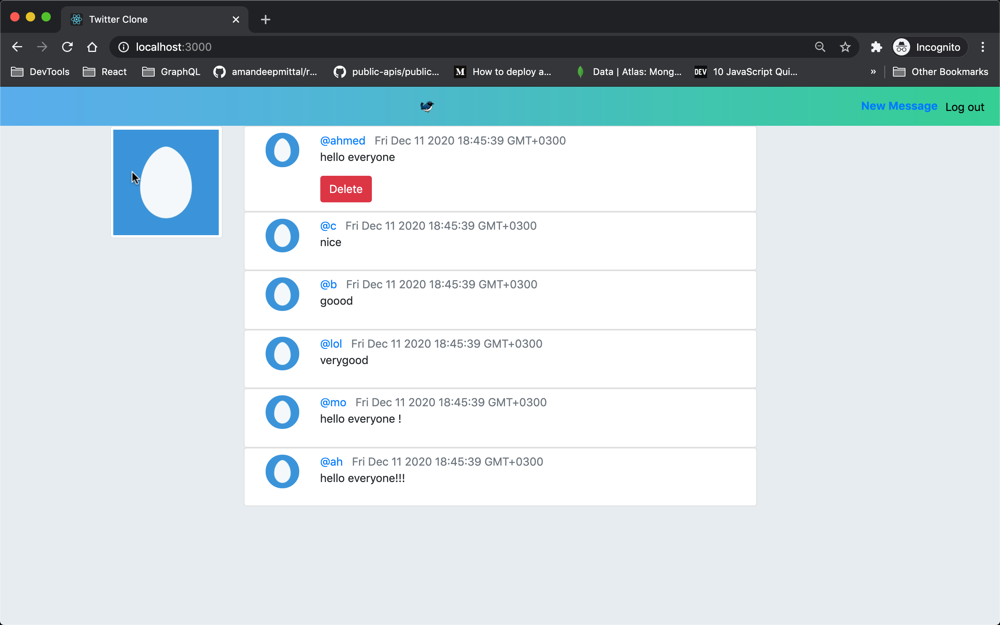

# Twitter_Clone
### This project uses MERN stack with Redux
( Mongodb, Express, React, Node )

# Discription
<strong>Twitter Clone</strong> is a web application the can let users  to sign up / login. they can add as many Tweets as they like and the ability to delete them.

# Screenshots of The Project
## Home Page Form 

## Sign up

## Log in 

## Redux 

## Message List 
